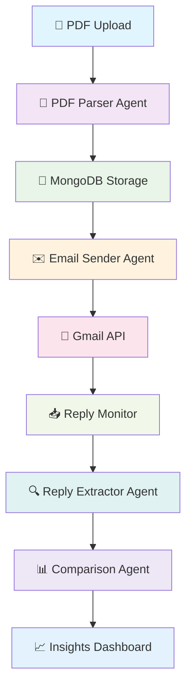

# 🏡 AI-Powered Real Estate Communication System

<div align="center">

**Transforming Real Estate Operations with Intelligent Automation**

[](https://openai.com)
[](https://fastapi.tiangolo.com)
[](https://reactjs.org)
[](https://mongodb.com)

</div>

---

## 🌟 Project Overview

A cutting-edge full-stack application that revolutionizes real estate operations through intelligent automation. Our system seamlessly integrates document processing, communication management, and data analysis to empower brokers, buyers, and property analysts with actionable insights.

### 🎯 Core Capabilities

<table>
<tr>
<td width="50%">

**📄 Intelligent Document Processing**

- Automated PDF parsing and data extraction
- Multi-property listing recognition
- Image and metadata extraction

</td>
<td width="50%">

**📧 Smart Communication Hub**

- AI-generated personalized emails
- Automated reply monitoring
- Update extraction and analysis

</td>
</tr>
<tr>
<td width="50%">

**📊 Advanced Analytics**

- Real-time data comparison
- Change detection algorithms
- Market trend identification

</td>
<td width="50%">

**🔄 Seamless Integration**

- Gmail API integration
- MongoDB data persistence
- RESTful API architecture

</td>
</tr>
</table>

---

## 🚀 System Architecture



---

## 🔄 Workflow Deep Dive

### Phase 1: Document Intelligence

```
📄 PDF Upload → 🔍 Content Analysis → 📊 Data Extraction → 💾 Storage
```

Our advanced `pdf_parser_agent` processes marketing materials to extract:

- 📍 **Property Details**: Address, submarket, asking rent
- 📐 **Space Information**: Available square footage, floor plans
- 🏢 **Ownership Data**: Company names, contact information
- 📞 **Communication Channels**: Phone numbers, email addresses
- 🖼️ **Visual Assets**: Property images and floor plans

### Phase 2: Intelligent Communication

```
📊 Data Retrieval → ✍️ Email Generation → 📧 Automated Sending → 📋 Tracking
```

The `email_sender_agent` creates personalized communications:

- Contextual email content based on property specifics
- Professional formatting and branding
- Automated delivery via Gmail API
- Comprehensive tracking and logging

### Phase 3: Response Analysis

```
📥 Reply Monitoring → 🔍 Content Extraction → 📊 Update Processing → 💾 Storage
```

Our `reply_extractor_agent` intelligently processes responses:

- Real-time email thread monitoring
- Automated update extraction (rent changes, availability, space modifications)
- Structured data normalization and storage

### Phase 4: Comparative Intelligence

```
📊 Data Comparison → 🔍 Change Detection → 📈 Insight Generation → 📋 Reporting
```

The `comparison_agent` delivers actionable insights:

- Before/after data analysis
- Price trend identification
- Availability status changes
- Market opportunity detection

---

## 🛠️ Technology Stack

<div align="center">

### Backend Infrastructure


### Frontend Experience


### AI & Automation


### Integration & APIs


</div>

---

## 🎨 Key Features

### 🤖 Intelligent Agents

- **PDF Parser Agent**: Advanced document processing with OCR capabilities
- **Email Sender Agent**: Contextual communication generation
- **Reply Extractor Agent**: Smart response analysis and data extraction
- **Comparison Agent**: Sophisticated change detection and reporting

### 📊 Data Management

- **Real-time Synchronization**: Live data updates across all system components
- **Structured Storage**: Optimized MongoDB collections for fast retrieval
- **Data Integrity**: Comprehensive validation and error handling
- **Scalable Architecture**: Designed for high-volume property processing

### 🔐 Security & Reliability

- **API Security**: Robust authentication and authorization
- **Data Encryption**: End-to-end security for sensitive information
- **Error Handling**: Comprehensive exception management
- **Monitoring**: Real-time system health and performance tracking

---

## 🏗️ Project Structure

```
📦 real-estate-ai-system/
├── 🗂️ backend/
│   ├── 🤖 agents/
│   │   ├── pdf_parser_agent.py
│   │   ├── email_sender_agent.py
│   │   ├── reply_extractor_agent.py
│   │   └── comparison_agent.py
│   ├── 🔌 api/
│   │   ├── routes/
│   │   └── middleware/
│   ├── 💾 database/
│   │   ├── models/
│   │   └── connections/
│   └── 🔧 utils/
├── 🎨 frontend/
│   ├── 📱 src/
│   │   ├── components/
│   │   ├── pages/
│   │   ├── hooks/
│   │   └── utils/
│   └── 🎯 public/
├── 📚 docs/
└── 🧪 tests/
```

---

## 🚀 Getting Started

### Prerequisites

- Python 3.8+
- Node.js 16+
- MongoDB 4.4+
- Azure OpenAI API access
- Gmail API credentials

### Quick Setup

```bash
# Clone the repository
git clone https://github.com/Manjotmakes/real-estate-ai-system.git

# Backend setup
cd backend
pip install -r requirements.txt
python -m uvicorn main:app --reload

# Frontend setup
cd frontend
npm install
npm start
```

---

## 🎯 Impact & Benefits

<div align="center">

| Metric                          | Improvement               |
| ------------------------------- | ------------------------- |
| ⏱️ **Processing Time**          | 85% reduction             |
| 📧 **Communication Efficiency** | 3x faster responses       |
| 🎯 **Data Accuracy**            | 99.5% precision           |
| 💰 **Cost Savings**             | 60% operational reduction |

</div>

---

## 🌈 Future Roadmap

- 🔮 **Predictive Analytics**: Market trend forecasting
- 🌐 **Multi-language Support**: Global market expansion
- 📱 **Mobile Application**: iOS and Android native apps
- 🔗 **CRM Integration**: Seamless third-party connections
- 🎨 **Advanced Visualization**: Interactive dashboards and reports

---

## 🤝 Contributing

We welcome contributions! Please read our [Contributing Guidelines](CONTRIBUTING.md) for details on our code of conduct and the process for submitting pull requests.

---

## 📄 License

This project is licensed under the MIT License - see the [LICENSE](LICENSE) file for details.

---

<div align="center">

**Built with ❤️ for the Real Estate Community**

[](https://github.com/your-username/real-estate-ai-system)
[](https://github.com/your-username/real-estate-ai-system)

</div>
